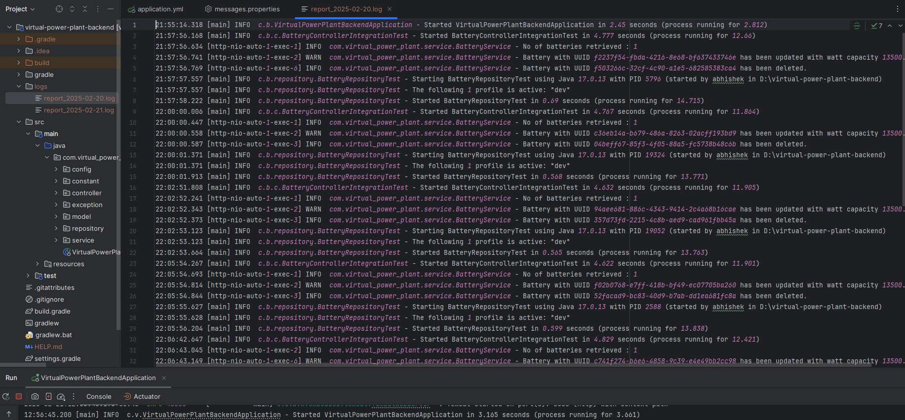

# Virtual Power Plant System

## Description

The Virtual Power Plant (VPP) is a system that integrates various power resources to provide grid powermanagement.
A VPP typically sells its output to an electric utility. VPPs allow energy resources that are individually too small to
be of interest to a utility to aggregate and market their power.

# **Project Setup**

## **Prerequisites**

- ***Java***

- ***Spring Boot***

- ***PostgreSQL***

- ***IDE(IntelliJ or any)***

## **Version**

- ***Java 17***

- ***Spring Boot 3.1***

- ***PostgreSQL(latest)***

# **Installation**

- For Java, install the suitable jdk in the project structure of the
  IDE [Java Installation](https://www.jetbrains.com/guide/java/tips/download-jdk/)

- For PostgreSQL, install the required drivers and run configuration files or run the database in a
  docker [PostgreSQL installation](https://www.jetbrains.com/help/idea/running-a-dbms-file.html), for community
  edition [PostgreSQL installation](https://www.youtube.com/watch?v=JMT5F7kQIGs)

# **Start**

- For gradle build `./gradlew clean build` and  `./gradlew bootRun`
- To run the application, the following environment variables must be configured. You can set them in your .env file at
  /resources.
  POSTGRES_USER: The username to connect to the PostgreSQL database. Example: POSTGRES_USER=username
  POSTGRES_PASSWORD: The password for the PostgreSQL database user. Example: POSTGRES_PASSWORD=123456789
  POSTGRES_URL: The JDBC URL to connect to the PostgreSQL database. It should include the host, port, and database name.
  Example: POSTGRES_URL=jdbc:postgresql://localhost:{port}/{db_name}
  LOGS_FOLDER_PATH: The path where the application logs will be stored. Example: LOGS_FOLDER_PATH=./logs

# **API Documentation - Swagger UI Access**

API Documentation - Swagger UI Access
Once the application is running, access the Swagger UI for API documentation
at: [Swagger UI] (http://localhost:8080/swagger-ui.html)


# **API Test Response**

Here's some example response from the **POST /api/v1/battery endpoint:

```json
{
  "status": true,
  "message": "Battery saved successfully.",
  "data": [
    {
      "id": "8b95276e-721a-4019-8d74-233e7934a7a6",
      "name": "Tesla Powerwall",
      "postCode": 90210,
      "wattCapacity": 13.5
    },
    {
      "id": "c609ccb3-9128-42f4-b52a-ec71e0acd137",
      "name": "LG Chem RESU",
      "postCode": 94043,
      "wattCapacity": 9.8
    },
    {
      "id": "fcf8c5a2-aaa3-481d-9332-10d82c03e1f4",
      "name": "SonnenBatterie",
      "postCode": 98101,
      "wattCapacity": 10
    },
    {
      "id": "b17b77da-8a72-412a-9f6c-32cc71a10b75",
      "name": "Enphase AC Battery",
      "postCode": 10001,
      "wattCapacity": 1.2
    },
    {
      "id": "abe33294-a64e-4463-b782-4dea277f18d7",
      "name": "BYD Battery-Box",
      "postCode": 30301,
      "wattCapacity": 15.4
    },
    {
      "id": "52ca20c8-9f54-4035-88d2-bae3e5c3ed53",
      "name": "Pylontech US2000B",
      "postCode": 33101,
      "wattCapacity": 2.4
    },
    {
      "id": "4e82896d-e04c-4491-806d-e6f06e4420ce",
      "name": "VARTA Pulse",
      "postCode": 75201,
      "wattCapacity": 8
    },
    {
      "id": "f09f7bbb-b432-4c15-9bcc-ab2f925967d9",
      "name": "ABB PowerStore",
      "postCode": 60601,
      "wattCapacity": 40
    }
  ],
  "error": null
}
```

To ensure the system can handle large numbers of concurrent battery registrations efficiently, I maintained a batch size
for saving batteries in bulk, reducing database calls. Connection pooling with HikariCP will optimize the reuse of
database connections,
minimizing connection overhead. Additionally, transaction management were implemented to ensures data integrity by
grouping
operations into a single transaction, enabling the system to handle large datasets with improved performance and
consistency.

# **Logging**

The application logs important events, including battery registrations, to a file regularly. Here’s a sample log of the
battery registration process:



**Log File Configuration:**

- Logs are stored in according to LOGS_FOLDER_PATH.
